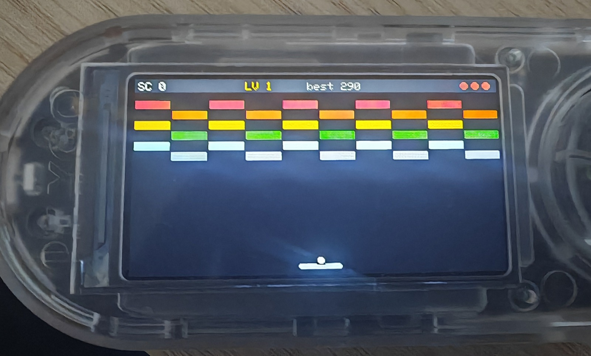
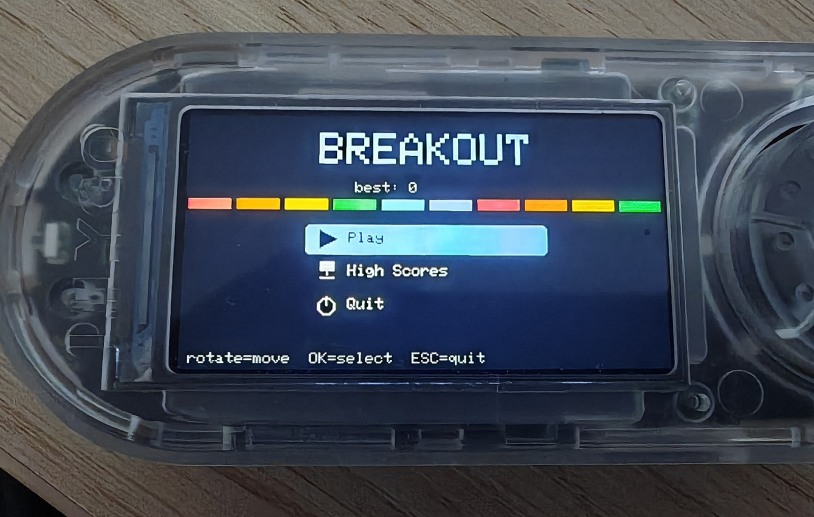
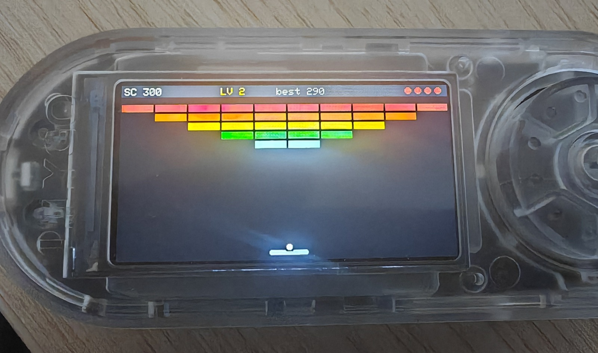
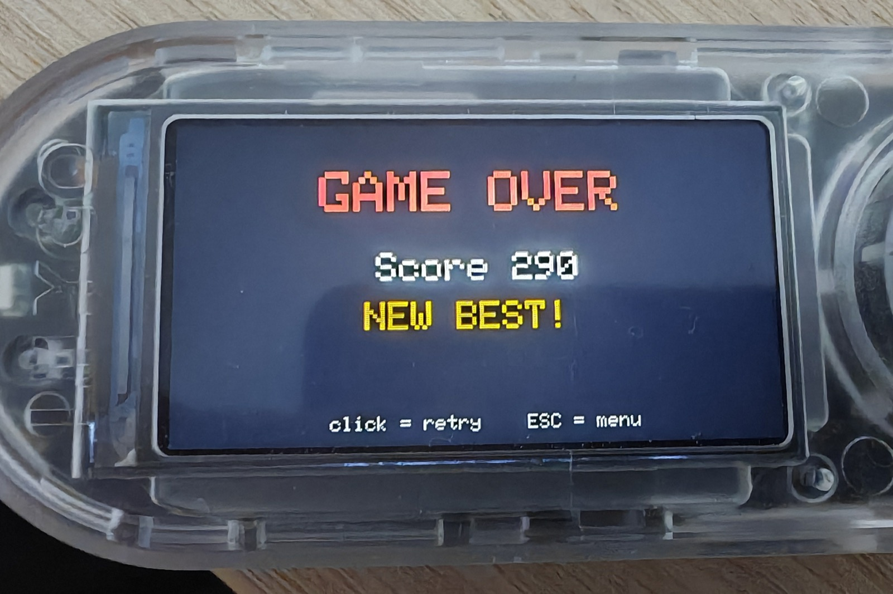

# 🧱 Breakout — Bruce / LilyGO T-Embed CC1101

  [-F7DF1E)](https://github.com/BruceDevices/firmware) 

> **EN** — A colorful **brick-breaker** for the Bruce JS interpreter, built around the rotary encoder. Changing level layouts, power-ups that drop from bricks, tough bricks, and a persistent top-5 high score table.

> **FR** — Un **casse-brique** coloré pour l'interpréteur JS de Bruce, pensé pour la molette. Des layouts de niveaux qui changent, des power-ups qui tombent des briques, des briques renforcées, et un tableau des 5 meilleurs scores sauvegardé.

## 🎮 Controls / Contrôles

**Rotate = move the paddle**, **click = launch the ball** (the bounce angle depends on where it hits the paddle), **ESC = menu**.

## ✨ Features / Fonctions

- 🧱 **Levels** — layouts cycle (full / checker / pyramid / stripes), colors per row, ball speeds up, and **tough 2-hit bricks** appear from level 3. "LEVEL n" flash.
- 🎁 **Power-ups** drop from bricks — catch them with the paddle:
  - **E** wider paddle · **M** multi-ball (up to 3) · **S** slow ball (8 s) · **L** extra life
- ❤️ **3 lives**, HUD with score / level / best / lives.
- 🏆 **Persistent top-5 high scores** (`/breakout_scores.json`) with **3-initials** entry on a record.
- 🖥️ Flicker-free incremental rendering, picto menu decorated with a brick row.

| Menu | Level 2 | Game over |
|---|---|---|
|  |  |  |

## 🚀 Install

1. Copy **`Breakout.js`** onto the SD card (e.g. `/scripts` or `/BruceJS`).
2. On the device: **JS Interpreter → select `Breakout.js`** (or add it to your favorites with [bruce-launcher](https://github.com/koua29/bruce-launcher)).
3. High scores are stored in `/breakout_scores.json` on the SD.

## 🛒 Matériel / Hardware

Le matériel utilisé pour ce projet — liens affiliés Amazon :

|  |  |  |
|:---:|:---:|:---:|
| 🔌 **[LilyGO T-Embed CC1101](https://link.amazon/B0cgD7wou)** avec antennes | ⬛ **[LilyGO T-Embed CC1101](https://link.amazon/B071fmsbH)** noir, sans antenne | 📡 **[Kit d'antennes SMA](https://link.amazon/B0eMlSqeZ)** |

En tant que Partenaire Amazon, je réalise un bénéfice sur les achats remplissant les conditions requises. · As an Amazon Associate I earn from qualifying purchases.

## 🙏 Credits & License

- Script: **koua29**. Runs on the excellent **[Bruce firmware](https://github.com/BruceDevices/firmware)**.
- Released under the **MIT License** — see [LICENSE](LICENSE).

## ☕ Coffee?

